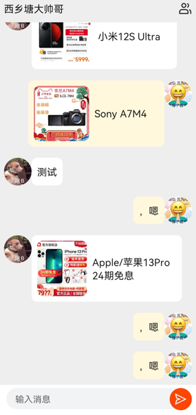
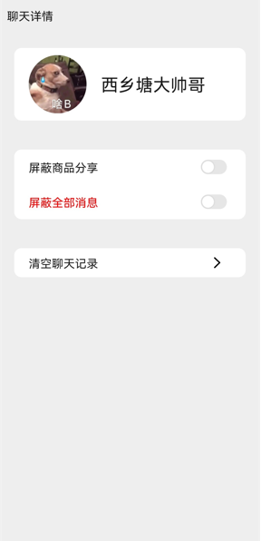
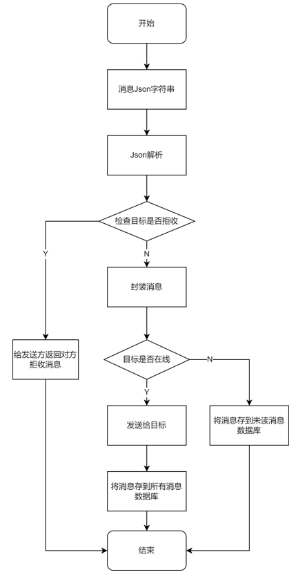

# 买为 ( buy it )

> 买为后端仓库: https://gitee.com/HRui66/buy-it-backend

## 介绍
一个仿淘宝的鸿蒙 HAP，使用 js 开发

## 模块设计 / 功能实现

发现

### 页面设计
发现页分有三个子页面：关注、发现、视频  
关注：展示看过的博主的动态  
发现：暂时分类的博主动态  
视频：一个短视频推送页面

消息

### 界面设计
#### 消息列表

#### 聊天对话

#### 用户对话设置

### 功能实现
#### 对话消息系统框架
消息处理的最基本需求是实现消息的实时发送接收和历史消息的存储，当前较热门的在线对话的实现是使用WebSocket，并且HarmonyOS应用开发JS API也同时提供了Socket和WebSocket的接口可以直接调用，所以采用了WebSocket作为对话消息系统的框架。

#### 消息类型
最基本的消息仅包括文本，由用户从输入框输入，点击发送。消息内容不需要进行额外的封装，发送端只需指定目标，消息内容字符串作为WebSocket的发送参数，即可进行发送。  
然而在购物应用的对话消息中，除了一般的文本消息外，还有一种常见的消息——商品分享消息。商品分享消息需包含商品标题、商品图片、商品链接（或ID），消息内容有多个种类，相当于需要把一个类的实例化对象进行发送，使用文本消息的发送方式不可行，所以需要对WebSocket发送和接收的消息参数进行规范定义。  
Json可以完美地满足发送一个对象的需求，在前端（JavaScript）使用JSON.stringify()方法将JavaScript对象转换为字符串，转换后的字符串就可以作为文本消息发送，在后端使用Gson的fromJson把消息进行解析，解析出来就是一个对象，包括前端序列化对象的所有值。  
由于对话消息包括文本消息和商品分享两种类型，所以需要在前后端约定不同消息类型的类型码（如字符串消息类型为1），在发送和接收不同类型消息时进行不同的消息解析处理。消息类型的约定如下：  

|           | type               | sender | receiver | content    |
|-----------|--------------------|--------|----------|------------|
| 字符串消息     | int NORMAL=1       | int    | int      | String     |
| 商品分享      | int SHARE=2        | int    | int      | jsonString |
| 消息被对方屏蔽   | int REJECT=3       |        |          |            |
| 对方不接收商品分享 | int REJECT_SHARE=4 |        |          |            |
| 屏蔽对方      | int BLACK=5        | int    | int      |            |
| 屏蔽对方分享    | int BLACK_SHARE=6  | int    | int      |            |

#### WebSocket消息处理后端
后端使用的是SpringBoot框架，所以使用SpringBoot整合WebSocket，在同一个Spring后端处理对话消息以及其它网络请求。
#### 消息处理逻辑
后端对消息的处理逻辑大致如下。先是拿到消息字符串，对字符串进行Json解析得到Json对象，然后通过消息类型码判断消息类型，对不同类型的消息分别处理。然后检查消息发送的目标是否拒收来自发送方的消息，如果拒收则给发送方返回拒收消息。否则封装消息，检查目标是否在线，在线则直接发送，离线则将此消息保存在消息数据库，等待目标上线再一次性发送所有消息。  

“我的”

### 页面设计
#### 个人中心
个人中心包括五分小模块，背景色为# f2f2f2，每个小模块背景色为#fefefe。
- 模块1为个人信息展示；
- 模块2由“收藏”、“订阅店铺”、“足迹”、“零钱”四个按钮组成；
- 模块3我的订单由“待付款”、“待收货”、“待发货”、“待评价”、“退款/售后”五个按钮组成；
- 模块4由“会员中心”、“领券中心”、“红包卡劵”、“红包签到”四个按钮组成；
- 模块5由“收货地址”、“官方客服”、“我的快递”、“我的评价”、“领券中心”、“来摇现金”、“店铺会员”、“更多”八个按钮组成。
  
  

#### 我的地址
我的地址包块两个子页面和三个模块组成，背景色为# f2f2f2，每个小模块背景色为#fefefe。
    
- 模块1为顶部信息“我的收货地址”、“管理”两个文本组成；
- 模块2 为收货地址内容，包含收货人，联系方式，详细地址，编辑按钮；
- 模块3 为底部添加地址按钮；
- 页面1 为修改收货地址页面；
 
- 页面2 为添加收货地址页面。
   
#### 我的订单
我的订单包括三个小模块，背景色为# f2f2f2。
- 模块1 顶部搜索，由搜索框、“筛选”文本、两个按钮组成；
- 模块2 tabs，由“全部”、“待付款”、“待发货”、“待收货”、“待评价”五个文本组成；
- 模块3 订单，包含店铺名、商品状态、商品价格、商品状态、商品名等，背景色为#fefefe。
   

#### 我的收藏
我的收藏包括三个小模块，背景色为# f2f2f2。
- 模块1 顶部信息，由“我的收藏”、收藏数量、搜索按钮、“管理”组成；
- 模块2 tabs，由“宝贝”、“图文”、“视频”、“话题”、“清单”组成；
- 模块3 收藏商品，包含商品名以及价格和商品图片，背景色为#fefefe。
   

### 页面功能
#### 个人中心
- 展示用户头像、用户账号、用户昵称。点击“收藏”，跳转到我的收藏页面；点击“我的订单”，跳转到我的订单页面；点击“收货地址”，跳转到我的地址页面。
#### 我的地址
- 地址进行编辑或添加，点击地址旁的编辑按钮，跳转到编辑地址页面；点击底部的“添加收货地址”按钮，跳转到添加地址页面。
#### 我的订单
- 展示用户的全部订单。
#### 我的收藏
- 展示用户的全部收藏商品，点击单个商品，能对跳转到对应商品的详情页。

### 页面数据渲染
#### 个人中心
  - 在页面初始化时，使用HTTP GET请求，使用登录成功后在全局变量中的用户账号作为请求参数，调用后端“通过账号查询用户信息”接口，获取到用户信息，并将数据渲染到页面上。
#### 我的地址
- 在页面初始化时，使用HTTP GET请求，使用登录成功后在全局变量中的用户账号作为请求参数，	调用后端“通过账号获得用户地址”接口，获取到用户地址，使用for循环将数据渲染到页面上。
- 添加地址时，将输入框的内容，封装成MyAddress对象，序列化成JSON字符串，调用后端“添加地址”接口，将JSON字符串发送到后端，并储存在MySQL数据库中。
- 修改地址时，发送POST请求，将当前点击的地址信息作为参数，跳转到修改地址页面，并将参数作为输入框的值，实现信息回填，修改之后，点击保存，封装成MyAddress对象，序列化成JSON字符串，调用后端“修改地址信息”接口，发送PUT请求，将JSON字符串发送到后端，对数据库存储的信息进行修改。
#### 我的订单
- 在页面初始化时，使用HTTP GET请求，使用登录成功后在全局变量中的用户账号作为请求参数，调用后端“通过账号获得用户订单”接口，获取到用户订单信息，使用for循环将数据渲染到页面上。
#### 我的收藏
- 在页面初始化时，使用HTTP GET请求，使用登录成功后在全局变量中的用户账号作为请求参数，调用后端“通过账号获得用户收藏商品”接口，获取到用户收藏商品信息，使用for循环将数据渲染到页面上。

## 实习心得
- （黄瑞）在本次实训中，学会了使用JavaScript进行鸿蒙应用进行开发，在开发过程中，全程使用Git进行版本控制，很好的贯彻了团队合作的思想，每个人都有自己的分工，相互独立又相互协作。我负责开发项目后台，以及鸿蒙前端“我的”模块，在进行开发时，深刻地体会到前后端的交互过程。同时，企业老师带来了不一样的学习方式——看官方文档，授人以鱼不如授人以渔，企业老师教会我们的不是某一门技术，而是教我们如何去学习某一门技术，在未来脱离学校，步入社会，我们的老师就是我们自己，知道怎么去学习新的技术，这对我们能力的提升具有很重大的意义。